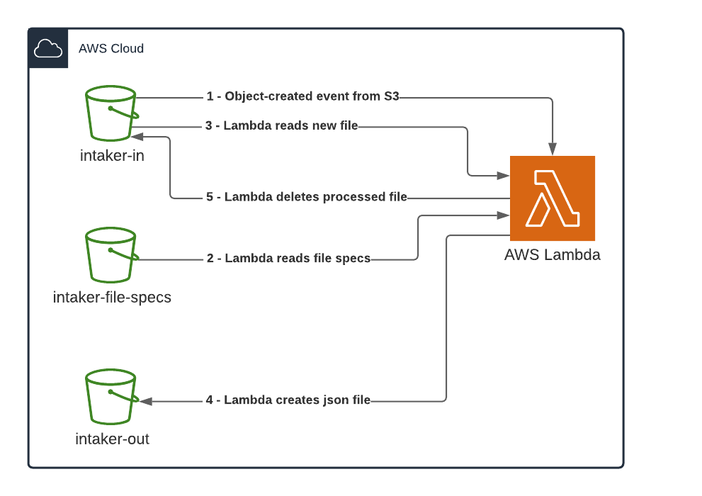

This project demonstrates how to use the Intaker library in an AWS Lambda.

The projects was created from the project template
`AWS Lambda Empty Function Project`

### References:
- https://docs.aws.amazon.com/lambda/latest/dg/with-s3-example.html
- https://docs.aws.amazon.com/lambda/latest/dg/csharp-package-toolkit.html

&nbsp;  
## Workflow:

The demo includes three S3 Buckets and one Lambda function.

**S3 Buckets**
Bucket name          | Description
-------------------|------------
intaker-in         | Input bucket. Data files are uploaded to this bucket and S3 triggers an event to execute the Lambda.
intaker-out        | Output bucket. When the Lambda executes it creates a json file with the data decoded from the input file.
intaker-file-specs | Configuration. Stores file specifications used when parsing data files.

&nbsp;  


&nbsp;  
## Configuring AWS to allow the Lambda function to read and write to S3 buckets.

Since in AWS S3 the bucket names are unique you need to replace the bucket names by your own bucket names. e.g. `intaker-in` could be `your-name-intaker-in`. The bucket names are used in AWS configuration and the application configuration file.

**Create buckets using the AWS Console or the AWS CLI tool.** All the buckets must be in the same AWS Availability Zone
- intaker-in
- intaker-out
- intaker-file-specs

**Using the AWS Console, create an IAM policy to grant access to the buckets.**  
Policy name: IntakerLambdaPolicy

JSON:
```json
{
    "Version": "2012-10-17",
    "Statement": [
        {
            "Effect": "Allow",
            "Action": [
                "logs:PutLogEvents",
                "logs:CreateLogGroup",
                "logs:CreateLogStream"
            ],
            "Resource": "arn:aws:logs:*:*:*"
        },
        {
            "Effect": "Allow",
            "Action": [
                "s3:GetObject",
                "s3:DeleteObject"
            ],
            "Resource": "arn:aws:s3:::intaker-in/*"
        },
        {
            "Effect": "Allow",
            "Action": [
                "s3:PutObject"
            ],
            "Resource": "arn:aws:s3:::intaker-out/*"
        },
        {
            "Effect": "Allow",
            "Action": [
                "s3:GetObject"
            ],
            "Resource": "arn:aws:s3:::intaker-file-specs/*"
        }
    ]
}    
```

**Using the AWS Console, create and configure the execution role that will be used by the Lambda**
Configuration | Value
-|-
Trusted entity | AWS Lambda.
Permissions | IntakerLambdaPolicy
Role name | IntakerLambdaRole

&nbsp;  
**Using the AWS CLI tool, configure Amazon S3 to publish events**

Grant Amazon S3 service principal (s3.amazonaws.com) permissions to perform the lambda:InvokeFunction action when files are uploaded to bucket `intaker-in`. The AWS CLI tool must be pre-configured with your profile to be able to execute the command.

`aws lambda add-permission --function-name IntakerFunction --principal s3.amazonaws.com --statement-id s3invoke --action "lambda:InvokeFunction" --source-arn arn:aws:s3:::intaker-in --source-account <account-id>`

&nbsp;  
**Using AWS Console, configure notifications**  
In the `intaker-in` bucket choose `Properties` and under `Event notifications` configure a notification with the settings:
Configuration | Value
-|-
Name | intaker-in-trigger
Events | All object create events.
Send to | Lambda function.
Lambda | IntakerFunction.

&nbsp;  
**Copy specs files to bucket intaker-file-specs**  
Upload the files `intaker.balance10.xml` and `intaker.sales10.xml` from folder `sample-files` into the bucket `intaker-file-specs`.

&nbsp;  
## AWS Lambda Project

File | Description
-|-
Function.cs | Class file containing a class with a single function handler method. A S3Event object is passed to this function containing the details of the file that was uploaded into the bucket.
aws-lambda-tools-defaults.json | Default argument settings for use with Visual Studio and command line deployment tools for AWS. Replace <profile> and <account-number> with your AWS settings.

&nbsp;  
## Here are some steps to follow from Visual Studio:

To deploy your function to AWS Lambda, right click the project in Solution Explorer and select *Publish to AWS Lambda*.

To view your deployed function open its Function View window by double-clicking the function name shown beneath the AWS Lambda node in the AWS Explorer tree.

To view execution logs of invocations of your function use the Logs tab in the opened Function View window.

&nbsp;  
## Executing the Lambda function:
Upload some of the cvs files from the folder `sample-files` into bucket `intaker-in`
